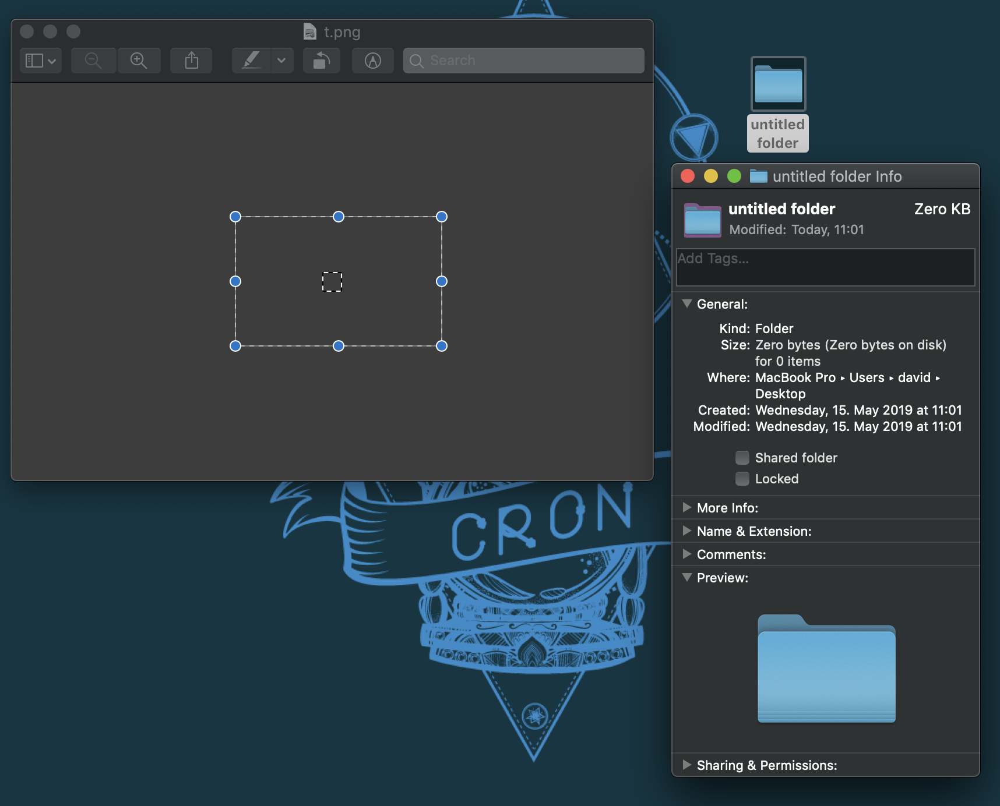
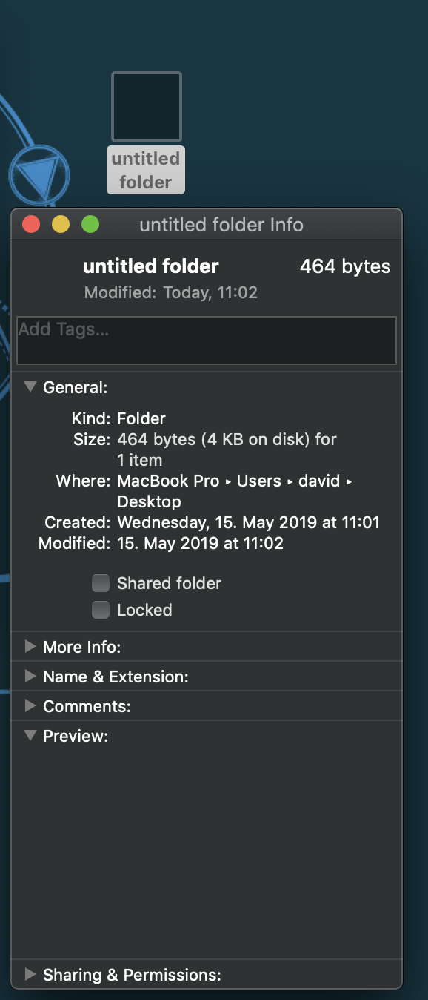
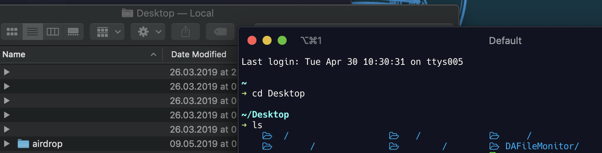

## How to create Invisible Icons

 1. Open etc/t.png in Preview
 2. Select the image and press command + C
 3. Create a new folder
 4. Select the Folder and press command + I
 5. Select the icon on the top left of the Info Sheet
 
 6. Press command + V

 

 7. Select the folder & rename it to " " (Keep in mind that you will have to add more spaces with every new folder)
 
 8. Done!

 
  

#### These will show up in Finder!

