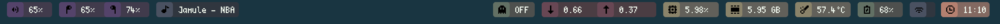

# dive
Modular Übersicht Widget Collection
- - -

## Screenshots
Bar:


Tiles:


Alt:


## Setup
```bash
git clone https://github.com/konstfish/dive && cd dive
./install.sh
```

How to create invisible folders: [ICONS](ICONS.md)

## Widgets

 - airpods.coffee (Displays battery status)
 - background.coffee (Loads the css)
 - battery.coffee (Displays battery status with icons)
 - connection.coffee (Displays an icon depending on the current connection)
 - cpu.coffee (Displays the current load on the cpu)
 - down.coffee/up.coffee (Displays network traffic)
 - mem.coffee (Displays amount of free ram)
 - music.coffee (Displays the current song. supports itunes, spotify or both)
 - temp.coffee (Displays the current cpu temperature)
 - time.coffee (Displays the current time)
 - vol.coffee (Displays an icon depending on the current %)
 - vpn.coffee (Displays an icon depending on the current VPN connection)

## Utils

 - widget-arranger (WIP) - changes the widgets order
 - refresh.py - Updates the refresh frequency of the Widgets

## TODO

 - [ ] Clean up CSS  
 - [ ] Write more widgets

## Credits

Learned & took a lot from: [Pecan](https://github.com/zzzeyez/pecan)
